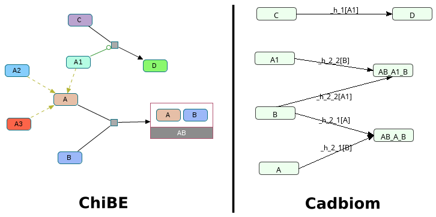

# biopax2cadbiom

Convert Biopax data (http://biopax.org) to Cabiom model (http://cadbiom.genouest.org).

Supplementary data: https://data-access.cesgo.org/index.php/s/bIbYc7B1dmnFGCd

## Installation

From PyPI:

	$ pip install biopax2cadbiom

From sources for development:

	# Install the package for developers...
	$ python2.7 setup.py develop

	# Uninstalling the package for developers...
	$ python2.7 setup.py develop --uninstall

## Help

    $ python -m biopax2cadbiom -h
    usage: __main__.py [-h] [-vv [VERBOSE]] {tests,model} ...

	biopax2cabiom is a script to transform a BioPAX RDF data from a triplestore to
	a CADBIOM model.

	optional arguments:
	-h, --help            show this help message and exit
	-vv [VERBOSE], --verbose [VERBOSE]

	subcommands:
	{tests,model}
		tests               Translates BioPAX test cases to cadbiom models and
							compares them with the cadbiom model reference (if it
							exists).
		model               Make CADBIOM model with BioPAX data obtained from a
							triplestore.

	$ python -m biopax2cadbiom model -h
	usage: __main__.py model [-h] [--pickleBackup] [--pickleDir [PICKLEDIR]]
							[--listOfGraphUri LISTOFGRAPHURI [LISTOFGRAPHURI ...]]
							[--triplestore [TRIPLESTORE]]
							[--cadbiomFile [CADBIOMFILE]] [--convertFullGraph]
							[--fullCompartmentsNames] [--blacklist [BLACKLIST]]

	optional arguments:
	-h, --help            show this help message and exit
	--pickleBackup        Allows to save/reuse the results of SPARQL queries.The
							goal is to save querying time during tests with same
							inputs. (default: False)
	--pickleDir [PICKLEDIR]
							Output file path to save the script variables.
							(default: backupPickle/backup.p)
	--listOfGraphUri LISTOFGRAPHURI [LISTOFGRAPHURI ...]
							List of RDF graph to be queried on the triplestore.
							(default: None)
	--triplestore [TRIPLESTORE]
							URL of the triplestore. (default: https://openstack-19
							2-168-100-241.genouest.org/sparql/)
	--cadbiomFile [CADBIOMFILE]
							Output file path to generate the Cadbiom model.2
							models are created: A basic model and a model without
							strongly connected components that block CADBIOM
							solver. (default: output/model.bcx)
	--convertFullGraph    Converts all entities to cadbiom nodes, even the
							entities not used. (default: False)
	--fullCompartmentsNames
							If set, compartments will be encoded on the base of
							their real names instead of numeric values. (default:
							False)
	--blacklist [BLACKLIST]
							If set, the entities in the given file will bebanished
							from conditions of transitions (ex: cofactors or
							entities of energy metabolism) (default: None)

## Examples of command line

    python -m biopax2cadbiom model --listOfGraphUri http://biopax.org/lvl3 http://www.pathwaycommons.org/reactome_v56
    python -m biopax2cadbiom model --pickleBackup --pickleDir backupPickle/backup.p --cadbiomFile output/tgfBetaTestModel.bcx --listOfGraphUri http://biopax.org/lvl3 http://www.pathwaycommons.org/tgfbrpathway

## Test cases

[//]: # (TESTS_START)
### {+ Reactome - Homarus_americanus.owl +}
__Command__: `python -m biopax2cadbiom model --listOfGraphUri http://biopax.org/lvl3 http://reactome.org/homarus`
  * [x] Expected result
  * [x] No errors
  * [x] No unexpected reactions

 

### {+ Reactome - Crithidia_fasciculata.owl +}
__Command__: `python -m biopax2cadbiom model --listOfGraphUri http://biopax.org/lvl3 http://reactome.org/crithidia`
  * [x] Expected result
  * [x] No errors
  * [x] No unexpected reactions

 

### {+ Reactome - Vigna_radiata_var._radiata.owl +}
__Command__: `python -m biopax2cadbiom model --listOfGraphUri http://biopax.org/lvl3 http://reactome.org/vigna`
  * [x] Expected result
  * [x] No errors
  * [x] No unexpected reactions

 

### {+ Reactome - Triticum_aestivum.owl +}
__Command__: `python -m biopax2cadbiom model --listOfGraphUri http://biopax.org/lvl3 http://reactome.org/triticum`
  * [x] Expected result
  * [x] No errors
  * [x] No unexpected reactions

 

### {+ Reactome - Cavia_porcellus.owl +}
__Command__: `python -m biopax2cadbiom model --convertFullGraph --listOfGraphUri http://biopax.org/lvl3 http://reactome.org/cavia`
  * [x] Expected result
  * [x] No errors
  * [x] No unexpected reactions

 

### {+ Virtual Cases - virtualCase1.owl +}
__Command__: `python -m biopax2cadbiom model --convertFullGraph --listOfGraphUri http://biopax.org/lvl3 http://virtualcases.org/1`
  * [x] Expected result
  * [x] No errors
  * [x] No unexpected reactions

 

### {+ Virtual Cases - virtualCase2.owl +}
__Command__: `python -m biopax2cadbiom model --convertFullGraph --listOfGraphUri http://biopax.org/lvl3 http://virtualcases.org/2`
  * [x] Expected result
  * [x] No errors
  * [x] No unexpected reactions

 

### {+ Reactome - Escherichia_coli.owl +}
__Command__: `python -m biopax2cadbiom model --convertFullGraph --listOfGraphUri http://biopax.org/lvl3 http://reactome.org/escherichia`
  * [x] Expected result
  * [x] No errors
  * [x] No unexpected reactions

 

### {+ Reactome - Cricetulus_griseus.owl +}
__Command__: `python -m biopax2cadbiom --convertFullGraph --listOfGraphUri http://biopax.org/lvl3 http://reactome.org/cricetulus`
  * [x] Expected result
  * [x] No errors
  * [x] No unexpected reactions

 

### {+ Reactome - Mycobacterium_tuberculosis.owl +}
__Command__: `python -m biopax2cadbiom model --convertFullGraph --listOfGraphUri http://biopax.org/lvl3 http://reactome.org/mycobacterium`
  * [x] Expected result
  * [x] No errors
  * [x] No unexpected reactions

 

### {+ Virtual Cases - virtualCase3.owl +}
__Command__: `python -m biopax2cadbiom model --listOfGraphUri http://biopax.org/lvl3 http://virtualcases.org/3`
  * [x] Expected result
  * [x] No errors
  * [x] No unexpected reactions

[//]: # (TESTS_END)
