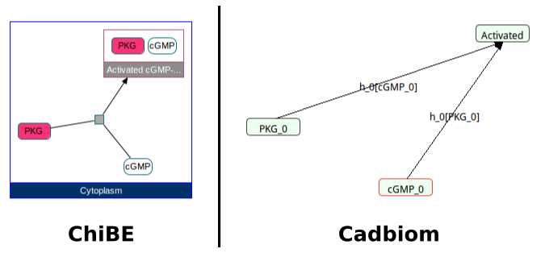
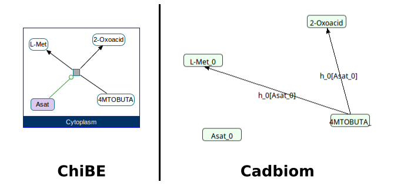
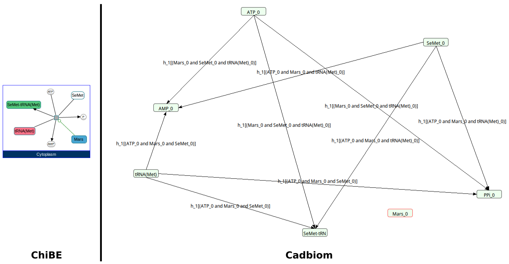
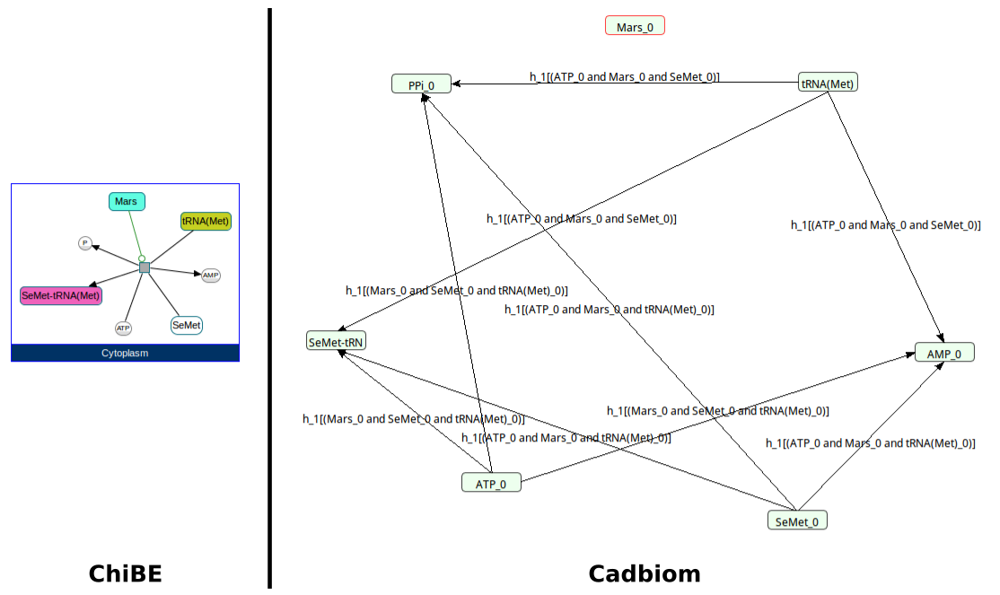
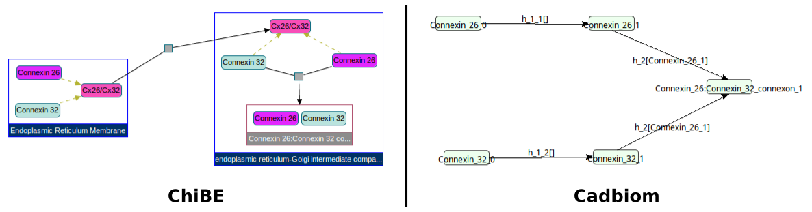
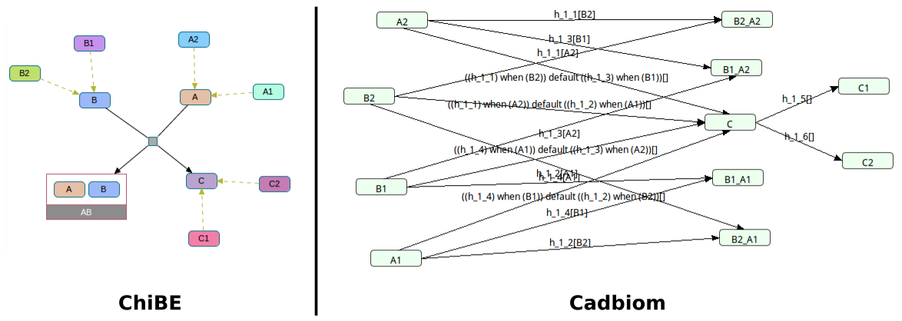
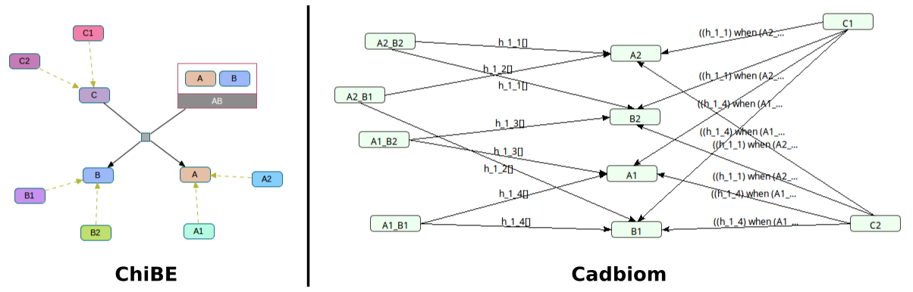
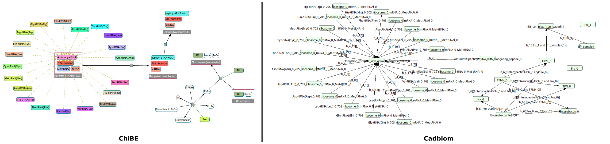
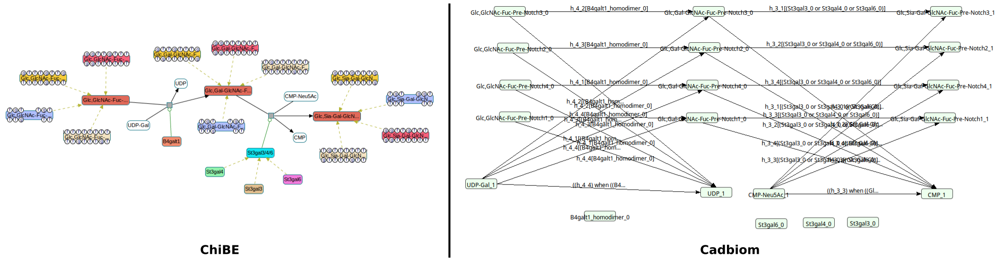

# biopax2cadbiom

Convert Biopax data (http://biopax.org) to Cabiom model (http://cadbiom.genouest.org).
Supplementary data: https://data-access.cesgo.org/index.php/s/bIbYc7B1dmnFGCd

## Help

    $ python -m src -h
    usage: __main__.py [-h] [-vv [VERBOSE]] [--pickleBackup [PICKLEBACKUP]]
                   [--listOfGraphUri LISTOFGRAPHURI [LISTOFGRAPHURI ...]]
                   [--cadbiomFile [CADBIOMFILE]] [--convertFullGraph]
                   [--fullCompartmentsNames] [--testCases]

    biopax2cabiom.py is a script to transform a Biopax data from a RDBMS to a
    Cabiom model.

    optional arguments:
    -h, --help            show this help message and exit
    -vv [VERBOSE], --verbose [VERBOSE]
    --pickleBackup [PICKLEBACKUP]
                            output file path to save the script variables.
    --listOfGraphUri LISTOFGRAPHURI [LISTOFGRAPHURI ...]
                            list of RDF graph.
    --cadbiomFile [CADBIOMFILE]
                            output file path to generate the Cadbiom model.
    --convertFullGraph    converts all entities to cadbiom nodes, even the
                            entities not used.
    --fullCompartmentsNames
                            If set, compartments will be encoded on the base of
                            their real names instead of numeric values.
    --testCases           translates Biopax test cases to cadbiom models and
                            compares them with the cadbiom model reference (if it
                            exists).

## Examples of command line

    python -m src --listOfGraphUri http://biopax.org/lvl3 http://www.pathwaycommons.org/reactome_v56
    python -m src --pickleBackup backupPickle/backup.p --cadbiomFile output/tgfBetaTestModel.bcx --listOfGraphUri http://biopax.org/lvl3 http://www.pathwaycommons.org/tgfbrpathway

## Test cases

[//]: # (TESTS_START)
### {+ Reactome - Homarus_americanus.owl +}
__Command__: `python -m src --listOfGraphUri http://biopax.org/lvl3 http://reactome.org/homarus`
  * [x] Expected result
  * [x] No errors
  * [x] No unexpected reactions

 

### {+ Reactome - Crithidia_fasciculata.owl +}
__Command__: `python -m src --listOfGraphUri http://biopax.org/lvl3 http://reactome.org/crithidia`
  * [x] Expected result
  * [x] No errors
  * [x] No unexpected reactions

 

### {+ Reactome - Vigna_radiata_var._radiata.owl +}
__Command__: `python -m src --listOfGraphUri http://biopax.org/lvl3 http://reactome.org/vigna`
  * [x] Expected result
  * [x] No errors
  * [x] No unexpected reactions

 

### {+ Reactome - Triticum_aestivum.owl +}
__Command__: `python -m src --listOfGraphUri http://biopax.org/lvl3 http://reactome.org/triticum`
  * [x] Expected result
  * [x] No errors
  * [x] No unexpected reactions

 

### {+ Reactome - Cavia_porcellus.owl +}
__Command__: `python -m src --convertFullGraph --listOfGraphUri http://biopax.org/lvl3 http://reactome.org/cavia`
  * [x] Expected result
  * [x] No errors
  * [x] No unexpected reactions

 

### {+ Virtual Cases - virtualCase1.owl +}
__Command__: `python -m src --convertFullGraph --listOfGraphUri http://biopax.org/lvl3 http://virtualcases.org/1`
  * [x] Expected result
  * [x] No errors
  * [x] No unexpected reactions

 

### {+ Virtual Cases - virtualCase2.owl +}
__Command__: `python -m src --convertFullGraph --listOfGraphUri http://biopax.org/lvl3 http://virtualcases.org/2`
  * [x] Expected result
  * [x] No errors
  * [x] No unexpected reactions

 

### {+ Reactome - Escherichia_coli.owl +}
__Command__: `python -m src --convertFullGraph --listOfGraphUri http://biopax.org/lvl3 http://reactome.org/escherichia`
  * [x] Expected result
  * [x] No errors
  * [x] No unexpected reactions

 

### {+ Reactome - Cricetulus_griseus.owl +}
__Command__: `python -m src --convertFullGraph --listOfGraphUri http://biopax.org/lvl3 http://reactome.org/cricetulus`
  * [x] Expected result
  * [x] No errors
  * [x] No unexpected reactions

 

### {+ Reactome - Mycobacterium_tuberculosis.owl +}
__Command__: `python -m src --convertFullGraph --listOfGraphUri http://biopax.org/lvl3 http://reactome.org/mycobacterium`
  * [x] Expected result
  * [x] No errors
  * [x] No unexpected reactions

[//]: # (TESTS_END)
