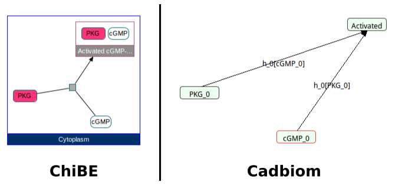
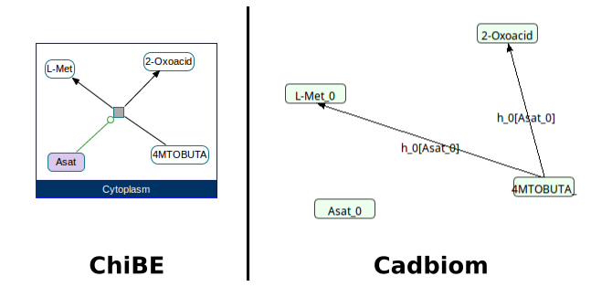
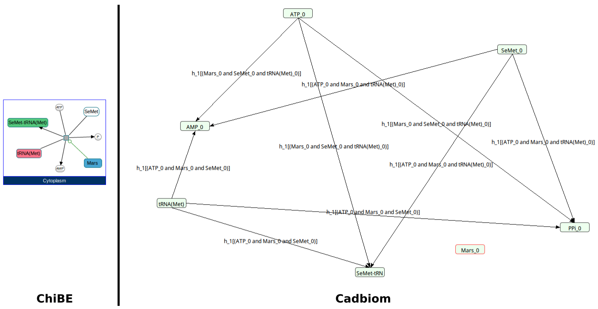
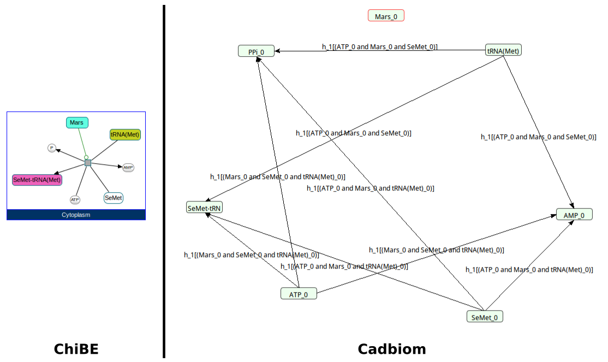
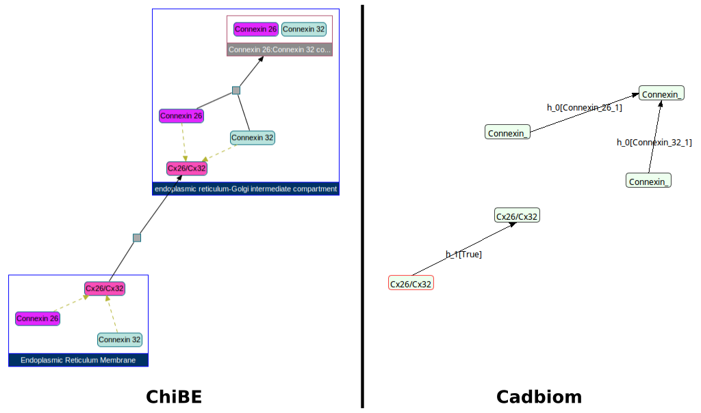
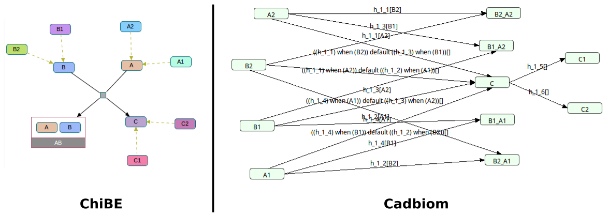
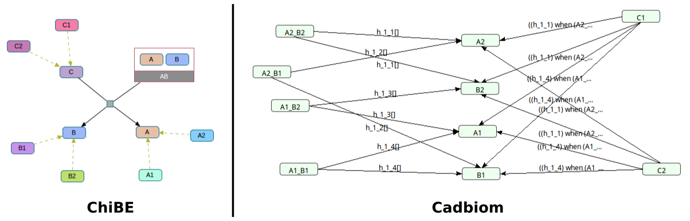

# biopax2cadbiom

Convert Biopax data (http://biopax.org) to Cabiom model (http://cadbiom.genouest.org).

## Help

	$ python -m src -h
	usage: __main__.py [-h] [--pickleBackup [PICKLEBACKUP]]
					[--listOfGraphUri LISTOFGRAPHURI [LISTOFGRAPHURI ...]]
					[--cadbiomFile [CADBIOMFILE]]

	biopax2cabiom.py is a script to transforme a Biopax data from a RDBMS to a
	Cabiom model.

	optional arguments:
	-h, --help            show this help message and exit
	--pickleBackup [PICKLEBACKUP]
							enter a file path to save the script variables.
	--listOfGraphUri LISTOFGRAPHURI [LISTOFGRAPHURI ...]
							enter a list of RDF graph.
	--cadbiomFile [CADBIOMFILE]
							enter a file path to generate the Cadbiom model.

## Examples of command line

	python3 -m src --listOfGraphUri http://biopax.org/lvl3 http://www.pathwaycommons.org/reactome_v56
	python3 -m src --pickleBackup backupPickle/backup.p --cadbiomFile output/tgfBetaTestModel.bcx --listOfGraphUri http://biopax.org/lvl3 http://www.pathwaycommons.org/tgfbrpathway

## Test cases

### {+ Reactome - Homarus_americanus.owl +}
__Command__: `python3 -m src --listOfGraphUri http://biopax.org/lvl3 http://reactome.org/homarus`
  * [x] Expected result
  * [x] No errors
  * [x] No unexpected reactions

 

### {+ Reactome - Crithidia_fasciculata.owl +}
__Command__: `python3 -m src --listOfGraphUri http://biopax.org/lvl3 http://reactome.org/crithidia`
  * [x] Expected result
  * [x] No errors
  * [x] No unexpected reactions

 

### {+ Reactome - Vigna_radiata_var._radiata.owl +}
__Command__: `python3 -m src --listOfGraphUri http://biopax.org/lvl3 http://reactome.org/vigna`
  * [x] Expected result
  * [x] No errors
  * [x] No unexpected reactions

 

### {+ Reactome - Triticum_aestivum.owl +}
__Command__: `python3 -m src --listOfGraphUri http://biopax.org/lvl3 http://reactome.org/triticum`
  * [x] Expected result
  * [x] No errors
  * [x] No unexpected reactions

 

### {+ Reactome - Cavia_porcellus.owl +}
__Command__: `python3 -m src --convertFullGraph --listOfGraphUri http://biopax.org/lvl3 http://reactome.org/cavia`
  * [x] Expected result
  * [x] No errors
  * [x] No unexpected reactions

 

### {+ Virtual Cases - virtualCase1.owl +}
__Command__: `python3 -m src --convertFullGraph --listOfGraphUri http://biopax.org/lvl3 http://virtualcases.org/1`
  * [x] Expected result
  * [x] No errors
  * [x] No unexpected reactions

 

### {+ Virtual Cases - virtualCase2.owl +}
__Command__: `python3 -m src --convertFullGraph --listOfGraphUri http://biopax.org/lvl3 http://virtualcases.org/2`
  * [x] Expected result
  * [x] No errors
  * [x] No unexpected reactions

